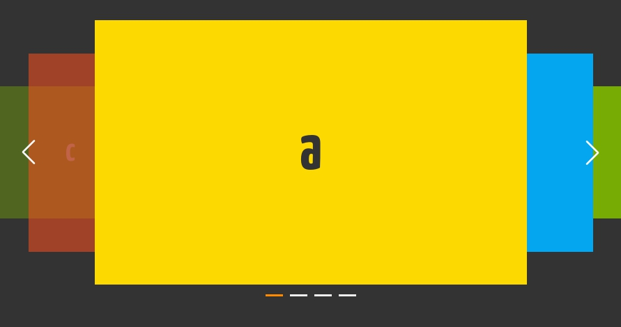

# jQuery版本旋转木马图片轮播插件



## 使用

#### 根据自己需求定义好样式【非必须】
```html
<style>
    .caroursel {
        margin: 150px auto 0;
        width: 1000px;
        height: 380px;
    }
    .caroursel img{
        display: block;
        max-width: 100%;
        max-height: 100%;
    }
</style>
```

#### 引入样式和脚本 **【必须】**
```html
<link rel="stylesheet" href="jquery.crs.css">
<script src="jquery.crs.js"></script>
```

#### 基本结构，其中 crs-wrap  crs-panel 为必须
```html
<!-- 基本结构， -->
<div class="caroursel crs-wrap js-crsWrap1">
    <div class="crs-panel">
        
        
        
        
    </div>
</div>
```

#### 调用
```html
<script>
    Lcrs('.js-crsWrap1', {
        autoPlay: false,
        vAlign: 'middle',
    });
</script>
```

## 可选配置
| 参数名     | 描述    | 数据类型   |  默认值  | 可选值  |
| --------  | :-----  | :-----  | :----  |:----  |
| wrapWidth   | 最外容器宽度   |  number  |   1000  | -  |
| wrapHeight   | 最外容器高度   |  number  |   380  | -  |
| focusWidth   | 焦点可视项的宽度   |  number  |   620  | -  |
| focusHeight   | 焦点可视项的高度   |  number  |   380  | -  |
| autoPlay   | 自动播放   |  boolean  |   false  | true \| false  |
| interval   | 自动播放频率  |  number  |    2500 (单位:ms)   | -  |
| duration   | 过场动画速率   |  number  |   380 (单位:ms)  | -  |
| vAlign   | 垂直对齐方式   |  string  |   380  | 'middle' \| 'top' \| 'bottom'  |
| prev   | 上翻按钮  |  boolean \| jQuery选择器  |  true  |  '.prevBtn' \| $('.prevBtn')  |
| next   | 下翻按钮  |  boolean \| jQuery选择器  |  true  |  '.nextBtn' \| $('.nextBtn')  |
| pager   | 分页器  |  boolean \| jQuery容器  |  true  |  $('.js-pager') |
| onChange | 切换时回调  |  function  |  $.noop  |  function(index, $item) |


## 联系
- email: luochongfei@126.com
- QQ: 11423215